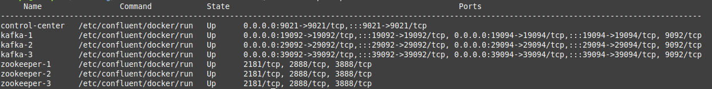
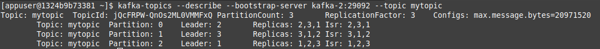
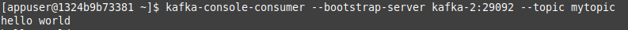
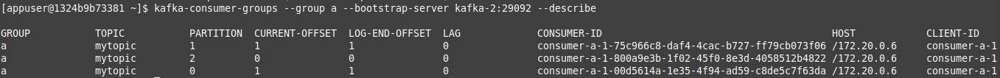

# Kafka Cluster & Control Center
Basic structure and examples to start with kafka to your projects.

## All Services

**Zookeeper(cluster), Kafka(cluster), Control Center and Kafka Topics Generator**



## Others

**Create Topic by `command line`**

Access container:
```bash
docker exec -ti kafka-1 bash
```

Run command to create:
```bash
kafka-topics --create --bootstrap-server kafka-2:29092 --replication-factor 3 --partitions 3 --topic mytopic
```

Run command to list:
```bash
kafka-topics --list --bootstrap-server kafka-2:29092
```

Run command to show topic details:
```bash
kafka-topics --describe --bootstrap-server kafka-2:29092 --topic mytopic
```


<br>

**Test `Producer` by `command line`**

Connect to topic:
```bash
kafka-console-producer --broker-list kafka-2:29092 --topic mytopic
```


<br>

**Test `Consumer` by `command line`**

Connect to topic:
```bash
kafka-console-consumer --bootstrap-server kafka-2:29092 --topic mytopic
```


Connect to topic with Consumer Group:
```bash
kafka-console-consumer --bootstrap-server kafka-2:29092 --topic mytopic --from-beginning --group a
```

Show Consumer Group details:
```bash
kafka-consumer-groups --group a --bootstrap-server kafka-2:29092 --describe
```


<br>

**Kafka Topics Generator**

Will create topics on startup by using kafka console. `kafka-topics`.